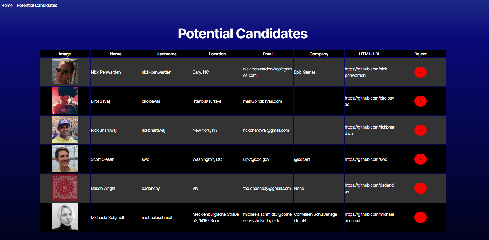

# Candidate Search

## Description

The Candidate Search application is a tool that allows employers to browse and save potential candidates from GitHub. It leverages the GitHub API to fetch user data and presents detailed candidate information, including name, username, location, email, company, avatar, and profile links. Employers can save candidates they are interested in, and remove them when no longer interested.

## Table Of Contents

- [Installation](#installation)
- [Usage](#usage)
- [Technologies Used](#technologies-used)
- [License](#license)
- [Deployment](#deployment)
- [Questions](#questions)

## Installation

No installation required for a user, please refer to the [Deployment](#deployment) section to get to the live app link.

For someone contributing to this application:

- Clone the repository to your local machine.
- Install node.js.
- Navigate to the directory of the candidate-search and run on the terminal: **npm i**. This should install all of the dependencies.

## Usage

Once the page is loaded, you will be have a card with a random candidate's information such as name, username, avatar, company, html-url and email. if you are uninterested in the candidate you can press the minus button to move to the next, if you are interested then you can press on the plus button that will save that candidate on the Potential Candidates page.

See the below screenshot as an example:

When you move to the Potential Candidates page, then you are presented with the candidates that you saved. if you feel like removing them from the list, simply hit the minus button all the way to the right.
It should be similar to the below screenshot.

See the below screenshot as an example:

## Technologies Used

- React
- Typescript
- Github API
- Vite
- Render

## License

This project is licensed under the MIT License. To learn more about this means, click the license button at the top.

## Deployment

Visit this [link](https://candidate-search-s6ch.onrender.com) to see the app live.

## Questions

GitHub Profile: https://github.com/Souad-hb

If you have any additional questions, feel free to contact me at: souadsalahh@gmail.com
